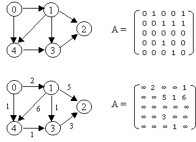
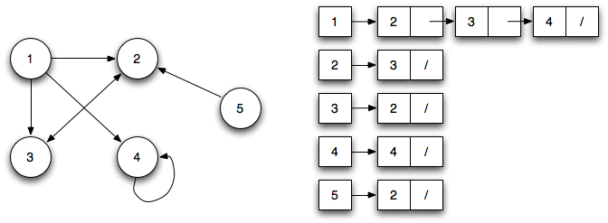

# Graph Representation

There are different ways of representing a graph, each of them with its own advantages and disadvantages. Here are the main two:

### Adjacency Matrix:

Data are stored in a **two-dimensional matrix**, in which the rows represent source vertices and columns represent destination vertices. Adjacency matrix is a `V x V` matrix in which entry `A[i][j] = 1` if there exists a path from vertex i to vertex j—else it is 0.
If the graph is **Undirected** then `A[i][j] = A[j][i]`, while the same is not necessary in the case of a directed graph. In a **Directed Graph**, if `A[i][j] = 1`, then `A[j][i]` may or may not be 1. 
Adjacency matrix can be easily modified to store cost of path `A[i][j] = C(i,j)` in case of weighted graph.

In the above image, former is showing an **Undirecte graph** representation and the later is showing a **Directed graph** representation. 

### Adjacency List:

The adjacency list is another way to represent a graph. It is a collection of lists (A) where A[i] contains vertices which are neighbors of vertex i. For a weighted graph, we can store weight or the cost of the edge along with the vertex in the list using pairs.

The space complexity of adjacency list is `O(V + E)` because in an adjacency list information is stored only for those edges that actually exist in the graph. In a lot of cases, where a matrix is sparse using an adjacency matrix may not be very useful. This is because using an adjacency matrix will take up a lot of space where most of the elements will be 0, anyway. In such cases, using an adjacency list is better.

- **Sparse Matrix:**  A sparse matrix is a matrix in which most of the elements are zero.
- **Dense Matrix:** A dense matrix is a matrix in which most of the elements are non-zero.

Performance of the two representations:

|                   | Adjacency List   | Adjacency Matrix         |
|-------------------|------------------|--------------------------|
| Storage           | O(\|V\| + \|E\|) | O(\|V\|2)     |
| Add vertex        | O(1)             | O(\|V\|2)     |
| Add edge          | O(1)             | O(1)                     |
| Remove vertex     | O(\|E\|)         | O(\|V\|2)     |
| Remove edge       | O(\|E\|)         | O(1)                     |
| `(u,v)` adjacent? | O(\|V\|)         | O(1)                     |

### More on this topic
- [From Theory To Practice: Representing Graphs - Medium.com:BaseCS](https://medium.com/basecs/from-theory-to-practice-representing-graphs-cfd782c5be38)
- [Graph Representation - HackerEarth](https://www.hackerearth.com/practice/algorithms/graphs/graph-representation/tutorial/)
- [Graph Representtaion - Codementor](https://www.codementor.io/rishabhdaal/graph-algorithms-interview-questions-du1085u8l#graph-representation)
- [Graph Representation - Khan Academy](https://www.khanacademy.org/computing/computer-science/algorithms/graph-representation/a/representing-graphs)