# Graph Theory

In mathematics and Computer Science, **Graph theory** is the study of Graphs.  **Graphs** are a way to formally represent a network, which is basically just a collection of objects that are all interconnected. Graphs are made up of **vertices(V)**, also known as points or nodes, and joined together by **Edges(E)**, also known as arcs or lines. 


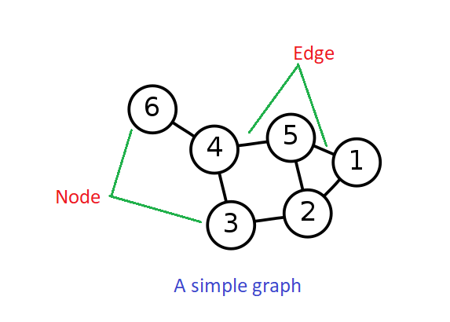

Edges are represented as ordered pairs (u, v) where (u, v) indicates that there is an edge from vertex u to vertex v. Edges may contain cost, weight, or length.


### A little bit of History

**[Leonhard Euler](https://en.wikipedia.org/wiki/Leonhard_Euler)** is regarded to have started this area of Discrete Mathematics in 1736 by describing The Königsberg Bridge Problem. 
The city of Konigsberg occupied two islands plus the areas on both blanks. These regions were linked by seven bridges as shown below.

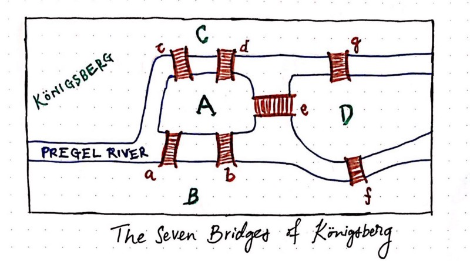

Now the problem is to find if one could start from his/her home and walk around the city in a way that would involve crossing each bridge exactly once and return to home. 

Euler approached the problem in a different way. He visualized the seven bridges problem as a network, which eventually became the basis for the graph structure that we know today. That visualization was kind of like the following.

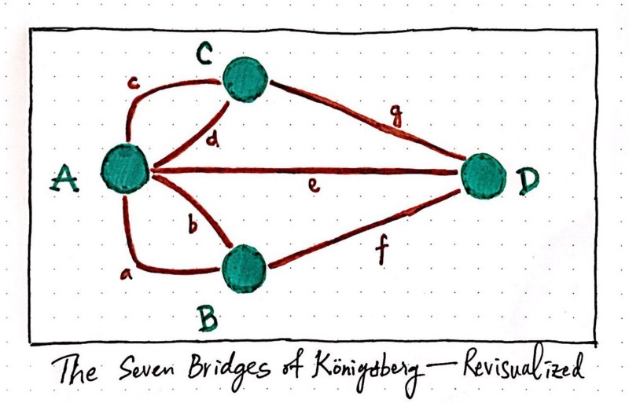

Using this type of representation, Euler proved that if each bridge has to be traversed exactly once, it follows that each part of land must have even number of bridges touching it, one bridge to enter into land and other to leave from it. Clearly, all the land masses here have odd number of bridges touching them. So there doesn't exist such a walk.Euler proved it couldn’t be done because he worked out that to have an odd vertex you would have to begin or end the trip at that vertex. (Think about it). Since there can only be one beginning and one end, there can only be two odd vertices if you’re going to be able to trace over each arc only once. Since the bridge problem has 4 odd vertices, it just isn’t possible to do!

[Here](https://medium.com/basecs/k%C3%B6nigsberg-seven-small-bridges-one-giant-graph-problem-2275d1670a12) is a nice article about the Königsberg Bridge Problem.
 

### Some Definitions to start with

#### Order of a Graph

The **Order** of a graph is the number of vertices in it, usually denoted `|V|` or `|G|` or sometimes `n`.

#### Size of a Graph

The **Size** of a graph is the number of edges in it, denoted `|E|` or `||G||` or sometimes m. 

If `n = 0` and `m = 0`, the graph is called *empty* or *null*. If `n = 1` and `m = 0`, the graph is considered *trivial*. If `n >= 1` and `m = 0`, the graph is called *discrete*.


#### Adjacent Node

If there is an edge that connects two nodes, we say that those nodes are **Adjacent nodes**. 

#### Degree

The **degree** of a node v, denoted **deg(v)**, is the number of edges incident to it. In a directed graph, the **in-degree** and **out-degree** count the number of directed edges coming into and out of a vertex respectively.

#### Loop and Multiple Edges

A **loop** is an edge whose endpoints are equal i.e., an edge joining a vertex to it self is called a **loop**. We say that the graph has **multiple edges** if in the graph two or more edges joining the same pair of vertices.

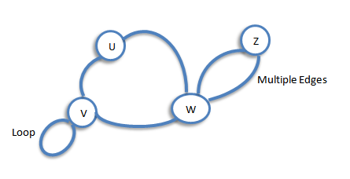

#### Simple Graph

A graph with no loops or multiple edges is called a **simple graph**.

#### Path

If it is possible to traverse a graph from two vertices, *u* and *v*, then it is said the the two vertices, *u* and *v*, are connected and there is a **Path** between *u* and *v*. A path represents which node we’re starting from, which edges we’re passing through, and which node we’re ending at.

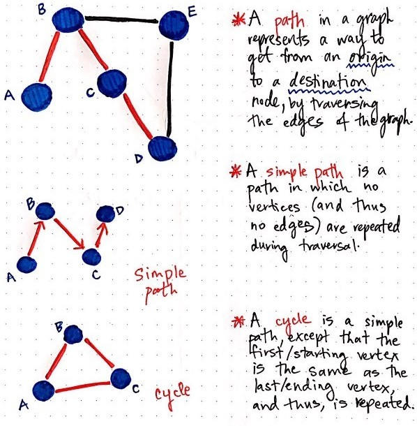

There could be more than one path from a vertex,*u*, to another vertex, *v*. The shortest distance path is known as the **Shortest Path**.

#### Connected Graph

If there is *u-v* path for every pair of vertices *u* and *v* in a graph, then the graph is called **Connected**.

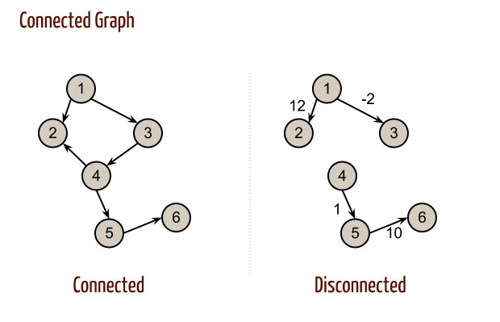


### Types of Graphs

#### Undirected Graph
An **undirected graph** is a graph in which all the edges are bidirectional, that is, edges don’t point in a specific direction.

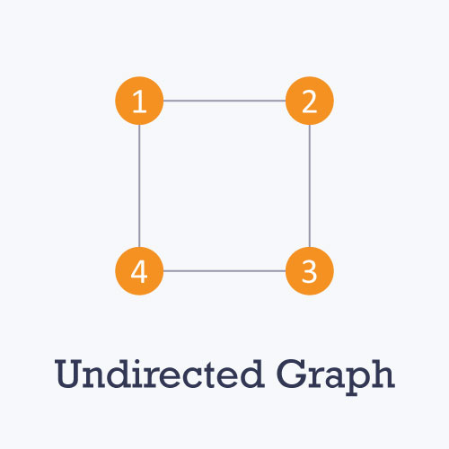
*Image Credit: [HackerEarth](https://www.hackerearth.com/practice/algorithms/graphs/graph-representation/tutorial/)*

#### Directed Graph
A **directed graph** or **digraph** is a graph in which all the edges are uni-directional i.e. the edges point in a single direction.

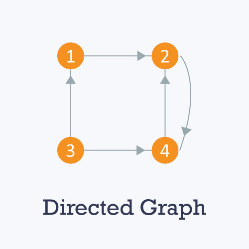
*Image Credit: [HackerEarth](https://www.hackerearth.com/practice/algorithms/graphs/graph-representation/tutorial/)*


#### Weighted Graph
In a **weighted graph**, each edge is assigned a weight or cost. 

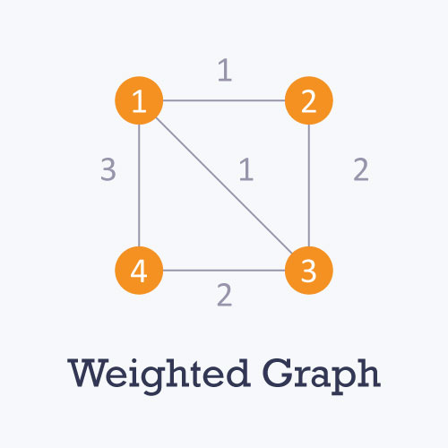
*Image Credit: [HackerEarth](https://www.hackerearth.com/practice/algorithms/graphs/graph-representation/tutorial/)*

Consider a graph of 4 nodes as in the diagram above. As you can see each edge has a weight/cost assigned to it. If you want to go from vertex 1 to vertex 3, you can take one of the following 3 paths:
```
1 -> 2 -> 3
1 -> 3
1 -> 4 -> 3
```
Therefore the total cost of each path will be as follows: - The total cost of `1 -> 2 -> 3` will be (1 + 2) i.e. 3 units - The total cost of `1 -> 3` will be 1 unit - The total cost of `1 -> 4 -> 3` will be (3 + 2) i.e. 5 units.
If the edges have no weight or cost then that graph would be known as Unweighted Graph. Generally in an Unweighted graph it considered that all edges have similar cost and that is 1.


#### Cyclic Graph
A graph is called **Cyclic** if it contains a path that starts and ends on the same vertex; such paths are called **Cycle**. A Graph containing no cycle is called **Acyclic Graph**.

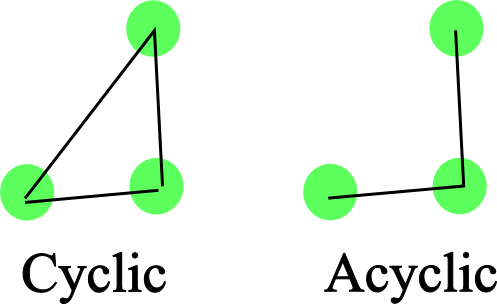

If a Directed graph has no cycle, then it is called **Directed Acyclic Graph or DAG**.

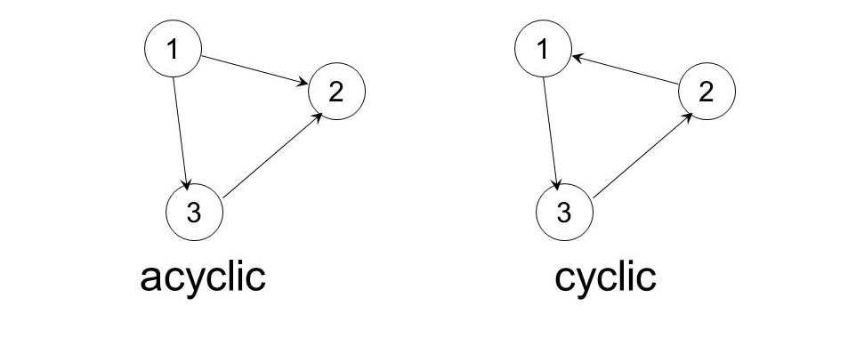

#### Tree
A **Tree** is an Acyclic Graph such that there exists exactly one path between any pair of vertices and have N-1 edges with N vertices.

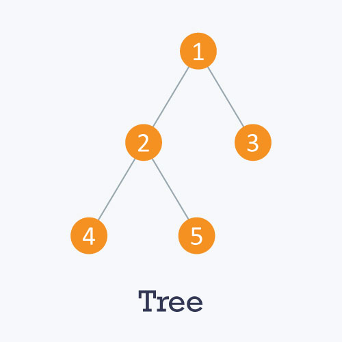
*Image Credit: [HackerEarth](https://www.hackerearth.com/practice/algorithms/graphs/graph-representation/tutorial/)*

Each node in a graph may have one or multiple parent nodes. However, in a tree, each node (except the root node) comprises exactly one parent node.
A root node has no parent.
There are three types of Node in a Tree.
- **Root node:** The root node is the ancestor of all other nodes. It does not have any ancestor. Each tree consists of exactly one root node. In the Tree image above, 1 is the Root Node.
- **Leaf nodes:** In a tree, leaf nodes represent the nodes that do not have any successors. These nodes only have ancestor nodes. In the Tree image above, 3, 4, 5 are Leaf nodes. 
- **Internal nodes:** Other than Root node and the leaf nodes, all other nodes are Internal nodes. In the Tree image above, 2 is an internal node.

A **Forest** is a collections of trees, mostly analogous to real life. That means, if all the connected components in a graph are treest then it is a Forest. 

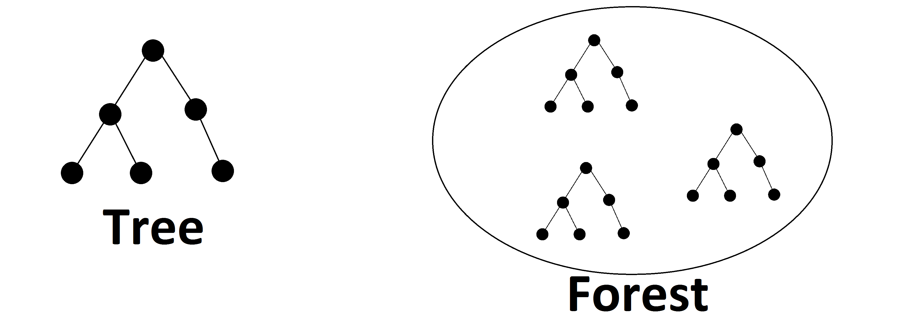 


### Applications

Graphs can be used to model many types of relations and processes in physical, biological, social and information systems. Many practical problems can be represented by graphs.
To learn more, see [here](https://en.wikipedia.org/wiki/Graph_theory#Applications).

### More on this topic
- [Graph Theory - Wikipedia](https://en.wikipedia.org/wiki/Graph_theory)
- [Graph Tutorial - HackerEarth](https://www.hackerearth.com/practice/algorithms/graphs/graph-representation/tutorial/)
- [A gentle introduction to graph theory - BaseCS:Medium.com](https://medium.com/basecs/a-gentle-introduction-to-graph-theory-77969829ead8)
- [Graph Algorithms - Codementor](https://www.codementor.io/rishabhdaal/graph-algorithms-interview-questions-du1085u8l)

