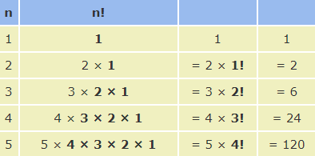

# Factorial

In mathematics, the **factorial** of a non-negative integer n, denoted by **n!**, is the product of all positive integers less than or equal to n. For example:

```
 5! = 1 * 2 * 3 * 4 * 5
    = 120
```

We can easily calculate a factorial from the previous one:



So, the rule is:
```
n! = n × (n−1)!
```
> The value of 0! is 1, according to the convention for an [empty product](https://en.wikipedia.org/wiki/Empty_product).

Factorials are used in many areas of mathematics, but particularly in Combinations and Permutations.

### More on this topic
- [Wikipedia](https://en.wikipedia.org/wiki/Factorial)
- [Factorial - MathisFun](https://www.mathsisfun.com/numbers/factorial.html)
- [khanacademy](https://www.khanacademy.org/computing/computer-science/algorithms/recursive-algorithms/a/the-factorial-function)
